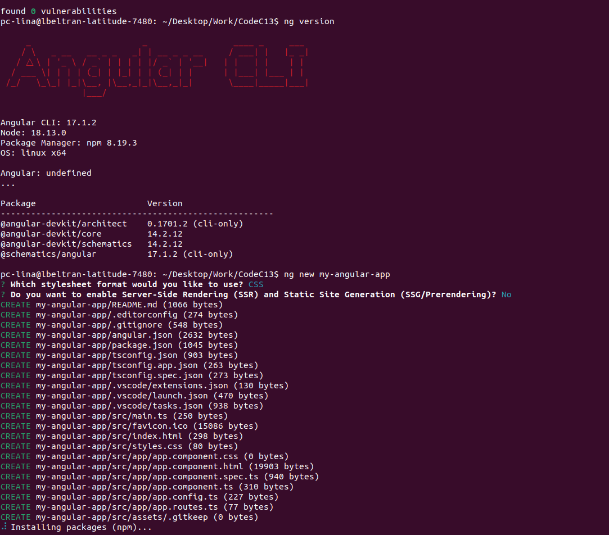
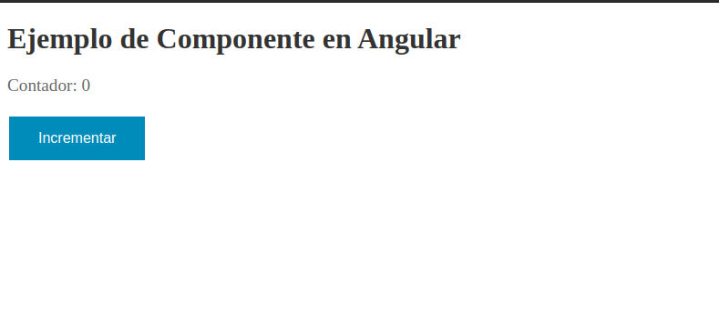

# Angular components exercise

## Prerequisites

1. Be sure to have Node.js (v8.9 or above) installed.
2. Be sure to have npm package manager (v5.5.1 or above) installed.
3. Be sure to have the Angular CLI installed globally on your machine.

   - You can install it globally on your machine with the following command:

   ```bash
   npm install -g @angular/cli
   ```

   - You can verify that you have the Angular CLI installed by running the
     following command in your terminal:

   ```bash
    ng --version
   ```

   Note: If node is a problem, you can use `nvm` to install a specific version
   of for example `v14.17.0`:

   ```bash
    nvm install 14.17.0
   ```

   Then you can use it with:

   ```bash
   nvm use 14.17.0
   ```

## Step 1: Create a new Angular project

In your terminal navigate to the directory where you want to create your new
project, and run the following command:

```bash
ng new my-angular-app
```

You should see a series of prompts asking you to choose various options for your
like this



## Step 2: create a new component

Navigate into your new project's directory:

```bash
cd my-angular-app
```

open the project in your code editor

```bash
code .
```

Then create a new component using the following command: You can run the command
in the terminal or in the integrated terminal of your code editor.

```bash
ng generate component components/nombre-del-componente
```

replace "`nombre-del-componente`" with the name you want for your component, in
our case we will use `ejemplo`.

You can also use the following command to create a new component:

```bash
ng g c components/nombre-del-componente
```

Note: We are using the `components` directory to store our components, like we
saw in the theory section.

## Step 3: insert this code into the new component

```typescript
// Ejemplo.component.ts

import { Component } from "@angular/core";

@Component({
  selector: "app-ejemplo", // Selector del componente
  standalone: true, // Indica si el componente es independiente o no
  templateUrl: "./ejemplo.component.html", // Plantilla HTML del componente
  styleUrls: ["./ejemplo.component.css"], // Estilos CSS del componente
})
export class EjemploComponent {
  // Propiedades y métodos del componente
  titulo = "Ejemplo de Componente en Angular";
  contador = 0;

  incrementarContador() {
    this.contador++;
  }
}
```

## Step 4: insert this code into the new component's template

```html
<!-- ejemplo.component.html -->

<h1>{{ titulo }}</h1>
<p>Contador: {{ contador }}</p>
<button (click)="incrementarContador()">Incrementar</button>
```

## Step 5: insert this code into the new component's styles

```css
/* ejemplo.component.css */
h1 {
  color: #333;
  font-size: 2em;
}

p {
  color: #666;
  font-size: 1.2em;
}

button {
  background-color: #008cba; /* Blue */
  border: none;
  color: white;
  padding: 15px 32px;
  text-align: center;
  text-decoration: none;
  display: inline-block;
  font-size: 16px;
  margin: 4px 2px;
  cursor: pointer;
}
```

## Step 6: Use the new component in the app component

Open the `app.component.html` file and insert the following code:

```html
<!-- app.component.html -->

<app-ejemplo></app-ejemplo>
```

## Step 7: Import the new component `EjemploComponent` in the app.component.ts imports array

```typescript
@Component({
  selector: 'app-root',
  standalone: true,
  imports: [RouterOutlet, EjemploComponent], // Here
  templateUrl: './app.component.html',
  styleUrl: './app.component.css',
})
```

## Step 8: Serve the application

Serve the application using the following command:

```bash
npm start
```

## Step 9: Open your app in a browser

You can now navigate to http://localhost:4200/ in your browser to see your new

You should see the following in your browser:



## Exercise

1. look at the code and try to understand how it works.
2. inpect the page with the browser's developer tools, try to identify the
   component's template, styles and the component itself.

*congratulations, you've set up your first Angular application! From here, you*
