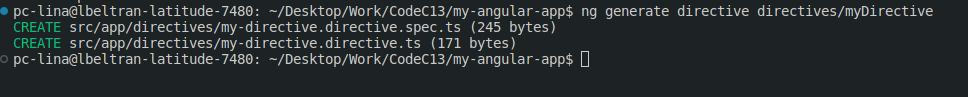
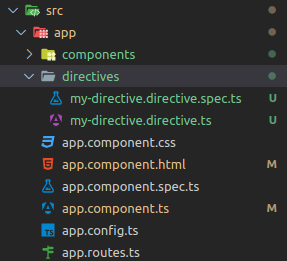

# Angular directives exercise

In the same Angular project you created in the previous exercise, you will
create a new directive.

## Step 1: Create a new directive

Navigate into your project's directory:

```bash
cd my-angular-app
```

Open the project in your code editor

```bash
code .
```

Then create a new directive using the following command: You can run the command
in the terminal or in the integrated terminal of your code editor.

```bash
ng generate directive directives/nombre-del-directiva
```

replace "`nombre-del-directiva`" with the name you want for your directive, in
our case we will use `myDirective`.

You can also use the following command to create a new directive:

```bash
ng g d directives/nombre-del-directiva
```

Note: We are using the `directives` directory to store our dicrectives, like we
saw in the theory section.

You should see a series of prompts like this:



And your project structure should look like this:



Can you see the new directive files? It should be in the `directives` directory.

## Step 2: insert this code into the new directive

Open the file `directives/my-directive.directive.ts` and insert the following
code:

```typescript
import { Directive, ElementRef, HostListener } from "@angular/core";

@Directive({
  selector: "[appResaltar]", // Selector de la directiva
})
export class ResaltarDirective {
  constructor(private elementRef: ElementRef) {}

  // Escucha el evento mouseenter y aplica estilos al elemento
  @HostListener("mouseenter") onMouseEnter() {
    this.resaltar("yellow");
  }

  // Escucha el evento mouseleave y restaura los estilos del elemento
  @HostListener("mouseleave") onMouseLeave() {
    this.resaltar("null");
  }

  // Método para aplicar estilos al elemento
  private resaltar(color: string) {
    this.elementRef.nativeElement.style.backgroundColor = color;
  }
}
```

## Step 3: import the new directive in the module app.module.ts

Open the file `app.module.ts` and import the new directive:

this should looks like this:

```typescript
import { NgModule } from "@angular/core";
import { CommonModule } from "@angular/common";
import { AppComponent } from "./app.component";
import { EjemploComponent } from "./components/ejemplo/ejemplo.component";
import { ResaltarDirective } from "./directives/my-directive.directive";
import { RouterOutlet } from "@angular/router";
import { BrowserModule } from "@angular/platform-browser";

@NgModule({
  declarations: [AppComponent, EjemploComponent, ResaltarDirective],
  imports: [CommonModule, RouterOutlet, BrowserModule],

  providers: [],
  bootstrap: [AppComponent],
})
export class AppModule {}
```

## Step 4: use the new directive in the component

Open the file `ejemplo.component.html` and replace the code with the following
code:

```html
<!-- Aquí se aplica la directiva -->
<div appResaltar>
  <h1>{{ titulo }}</h1>
  <p>Contador: {{ contador }}</p>
  <button (click)="incrementarContador()">Incrementar</button>
</div>
```

Add the `appResaltar` directive to the `div` element. This directive will apply
a yellow background to the element when the mouse enters and remove the
background when the mouse leaves.

## Step 5: run the project

Run the project using the following command:

```bash
ng serve
```

Open your browser and navigate to `http://localhost:4200/`. You should see the

#### **Note:** If you don see the app.module.ts file, you can create it in the **root** of the project like this:

```bash
ng g module app
```

And this should looks like in the step 3

Tip: Remove the standalones property from the component, because it is not
necessary. both in the app.component.ts and in the ejemplo.component.ts

```typescript
standalone: true,
```
