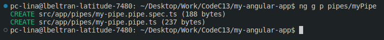
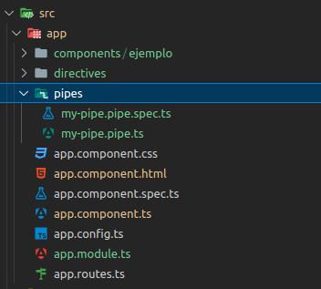

# Angular Pipes exercise

In the same Angular project you created in the previous exercise, you will
create a new pipe.

## Step 1: Create a new pipe

Navigate into your project's directory:

```bash
cd my-angular-app
```

Open the project in your code editor

```bash
code .
```

Then create a new pipe using the following command: You can run the command in
the terminal or in the integrated terminal of your code editor.

```bash
ng generate pipe pipes/nombre-del-pipe
```

replace "`nombre-del-pipe`" with the name you want for your pipe, in our case we
will use `myPipe`.

You can also use the following command to create a new pipe:

```bash
ng g p pipes/nombre-del-pipe
```

Note: We are using the `pipes` directory to store our pipes, like we saw in the
theory section.

You should see a series of prompts like this:



And your project structure should look like this:



Can you see the new pipe files? It should be in the `pipes` directory.

## Step 2: insert this code into the new pipe

Open the file `pipes/my-pipe.pipe.ts` and insert the following code:

```typescript
import { Pipe, PipeTransform } from "@angular/core";

@Pipe({
  name: "myPipe", // Nombre del pipe
})
export class MyPipePipe implements PipeTransform {
  transform(valor: string): string {
    return valor.toUpperCase(); // Transformación: convierte el texto a mayúsculas
  }
}
```

## Step 3: import the new pipe into the module file of your project app.module.ts

Open the file `app.module.ts` and insert the following code:

```typescript
import { NgModule } from "@angular/core";
import { CommonModule } from "@angular/common";
import { AppComponent } from "./app.component";
import { EjemploComponent } from "./components/ejemplo/ejemplo.component";
import { ResaltarDirective } from "./directives/my-directive.directive";
import { RouterOutlet } from "@angular/router";
import { BrowserModule } from "@angular/platform-browser";
import { myPipe } from "./pipes/my-pipe.pipe";

@NgModule({
  declarations: [
    AppComponent,
    EjemploComponent,
    ResaltarDirective,
    myPipe, // here
  ],
  imports: [CommonModule, RouterOutlet, BrowserModule],

  providers: [],
  bootstrap: [AppComponent],
})
export class AppModule {}
```

## Step 4: use the new pipe in a component

Open the file `components/ejemplo/ejemplo.component.html` and ireplace the code
with the following code:

```html
<!-- Aquí se aplica el pipe -->
<h1>{{ titulo | myPipe }}</h1>
<p>Contador: {{ contador | number }}</p>
<button (click)="incrementarContador()">Incrementar</button>
```

Add the `myPipe` pipe to the `h1` element. This pipe will transform the text
to uppercase.

## Step 5: run the project

Run the project using the following command:

```bash
ng serve
```

Open your browser and navigate to `http://localhost:4200/`. You should see the
