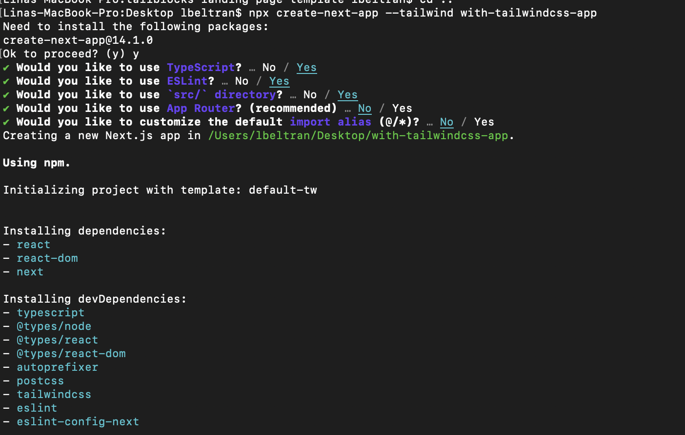
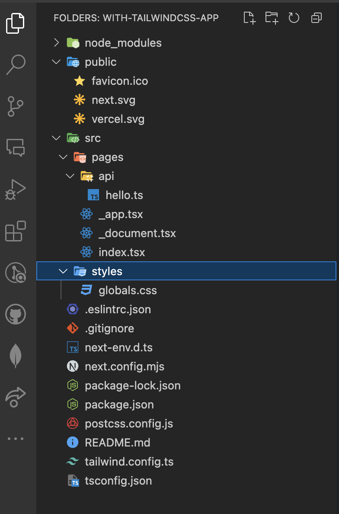
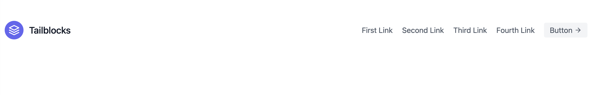
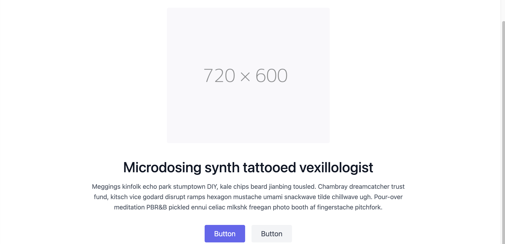
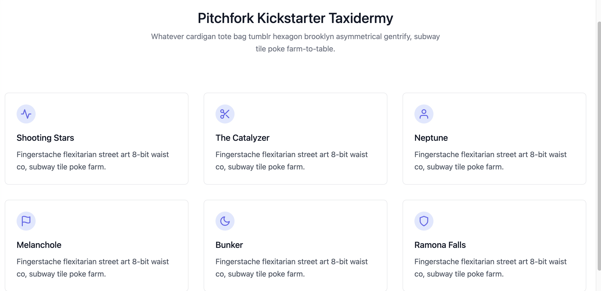
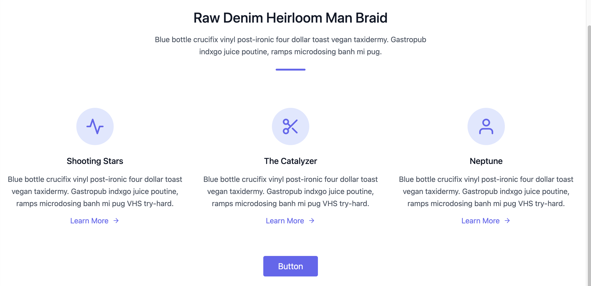
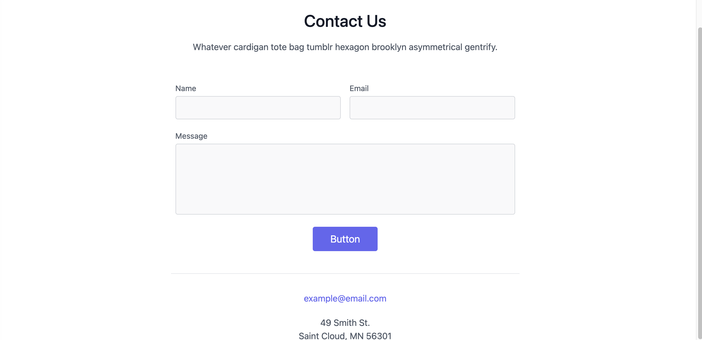

# Tutorial paso a paso para usar Next.js con Tailwind CSS

**Créditos para el autor:** Tomado del siguiente tutorial:
[link](https://www.youtube.com/watch?v=j8I1np91nYA)

## Contexto

Usaremos NextJs para ampliar las capacidades de React y Tailwind CSS para
estilizar nuestra aplicación. Además, usaremos PostCSS para procesar los estilos
de Tailwind CSS.

La idea es replicar un landing page donde el foco de nuestro trabajo estará en
los estilos y la estructura de la página y el responsive.

La idea es que al final veas algo como esto (GIF):


## Herramientas a usar

- Node.js: Entorno de ejecución para JavaScript.
- npm: Administrador de paquetes para JavaScript.
- [Next.js](https://nextjs.org/) 13.4.3: Framework de React.
- [Tailwind CSS](https://tailwindcss.com/) 3.3.2 : Framework de estilos.
- [PostCSS](https://postcss.org/) 8.4.x: Procesador de CSS.
- [react-toastify](https://www.npmjs.com/package/react-toastify) ^9.1.3:
  Notificaciones en pantalla. `npm install --save react-toastify`
- [Tailblocks](https://tailblocks.cc/): Bloques CSS Tailwind listos para usar

## Paso a paso

### Pre-configuración

1. **Crear un proyecto de Next.js**

   ```bash
   npx create-next-app --tailwind with-tailwindcss-app
   ```

   Esto creará un proyecto de Next.js con Tailwind CSS.

   En el proceso habrá que responder algunas preguntas, por ejemplo, si se desea
   usar TypeScript, etc. Y se verá algo así:

    nota: la carpeta `with-tailwindcss-app` es el nombre
   del proyecto. nota 2: las respuestas a las preguntas para nuestro caso de
   uso, se evidencian en la imagen en color turquesa o azul (Jejeje no estoy
   segura del color).

   la siguiente debería ser la estructura de archivos y carpetas inicial que
   veas al abrir tu proyecto en VSCode:

   

2. **Vamos a agregar 3 carpetas en dentro de la carpeta `src`**:

   - `components`: Aquí pondremos los componentes de React.
   - `hooks`: Aquí pondremos los hooks de React.
   - `app`: Aquí pondremos algunos componentes principales de la aplicación.

   **IMPORTANTE**: ve a la archivo `globals.css` de la carpeta `src/styles` y
   borra todo su contenido excepto las 3 primeras lineas, es decir, que quede
   así:

   ```css
   @tailwind base;
   @tailwind components;
   @tailwind utilities;
   ```

### Estructura layout y pages

3. **Dentro de la carpeta `app` crearemos los layout react principales, así que
   vamos a crear un archivo llamado `layout.tsx` y otro llamado `page.tsx`.**

`layout.tsx`: Este archivo contendrá la estructura principal de la aplicación,
como el encabezado(Header) y el pie de página (Footer), entre algunas otras
cosas.

```tsx
import "../styles/globals.css"; // Importamos los estilos globales de la aplicación.

import "react-toastify/dist/ReactToastify.css"; // Importamos los estilos de React Toastify el cual te permite agregar notificaciones a tu aplicación de forma sencilla.

import { Inter } from "next/font/google"; // Importamos la fuente Inter de Google Fonts.

// Claramente a estas alturasa del tutorial, estos componentes no existen, pero los crearemos más adelante.
import Header from "@/components/header";
import Footer from "@/components/footer";
const inter = Inter({ subsets: ["latin"] });

export const metadata = {
  // Configuramos los metadatos de la aplicación, esto es para SEO.
  title: "Tailblocks Template",
  description: "Generated by create next app",
};

export default function RootLayout({
  children,
}: {
  children: React.ReactNode;
}) {
  return (
    <html lang="en">
      <body className={inter.className}>
        <Header />
        {children}
        <Footer />
      </body>
    </html>
  );
}
```

`page.tsx`: Este archivo contendrá la estructura de las páginas de la
aplicación.

```tsx
// Estos componentes de la aplicación tampoco estan creados aun, pero para allá vamos.

import HeroSection from "@/components/hero-section";
import Content from "@/components/content";
import Feature from "@/components/feature";
import Contact from "@/components/contact";

// Este es el componente principal de la aplicación, al ser un landing page todo se renderiza aquí.
export default function Home() {
  return (
    <main>
      <HeroSection />
      <Content />
      <Feature />
      <Contact />
    </main>
  );
}
```

Nota: A esto le llamamos en la industria definir la estructura de la aplicación,
es decir, definir los componentes principales que tendrá la aplicación
(Claramente todo esto es posible si las etapas del ciclo de vida del software se
han ejecutado correctamente, en este caso `planeación` y `diseño`).

3. Agreguemos en esta carpeta el favicon que tendrá la aplicación. Elije de
   internet el que más te guste, pero asegúrate de que sea un archivo `.ico` y
   que se llame `favicon.ico`. o igual tambien te dejo acá uno que puedes usar:


Con esto tenemos la versión inicial de la estructura de la aplicación.

### Creemos los componentes necesarios para la aplicación

nota: En cada uno de los pasos siguientes, siempre que copies y pegues código de
TailBlocks, asegurate:

a. Crear primero la estructura básica del componente (es decir, el archivo
.tsx).

```tsx
import React from "react";

const ComponentName = () => {
  return (
    // aca pegas el código que necesitas y eliminas el que no
    <div>ComponentName</div>
  );
};

export default ComponentName;
```

b. Reemplaza todos los `class` por `className`, recuerda que estamos usando
React y acá nos movemos en el universo JSX.

4. Creemos el `Header`: Este componente contendrá el encabezado de la
   aplicación. Dentro de la carpeta `components` crearemos un archivo llamado
   `header.tsx`:

- Importante, este código viene literalmente copiado y pegado desde
  `TailBlocks`, UNA MARAVILLA, estas son las ventajas de usar componentes
  predisñados. Lo unico que debes hacer es ir al sitio web de TailBlock, buscar
  el componente que necesitas y copiar y pegar el código en tu archivo.

- No olvides nombrar el componente tal cual como lo llamaste en el archivo
  `layout.tsx` (en este caso `Header`).

  En este punto si levantas tu aplicación, deberías ver algo como esto:

  

5. Creemos el `Footer`: Este componente contendrá el pie de página de la
   aplicación. Dentro de la carpeta `components` crearemos un archivo llamado
   `footer.tsx`:

- Igual que el componente anterior, vas al sitio oficial de TailBlocks, buscas
  el componente que necesitas y copias y pegas el código en tu archivo.

- No olvides nombrar el componente tal cual como lo llamaste en el archivo
  `layout.tsx` (en este caso `Footer`).

  En este punto si levantas tu aplicación, deberías ver algo como esto:

  

6. Creemos el componente |: Este componente contendrá la sección principal de la
   aplicación. Dentro de la carpeta `components` crearemos un archivo llamado
   `hero-section.tsx`:

- Igual que el componente anterior, vas al sitio oficial de TailBlocks, buscas
  el componente que necesitas y copias y pegas el código en tu archivo.

- No olvides nombrar el componente tal cual como lo llamaste en el archivo, OJO,
  en este caso el nombre del componente es `HeroSection` y está importado en
  `pages.tsx`, sube un poco revisa.

  En este punto si levantas tu aplicación, deberías ver algo como esto
  (Claramente debes elegir la imagen que quieras usar allí):

  

7. Creemos el componente `Content`: Este componente contendrá la sección de
   contenido de la aplicación. Dentro de la carpeta `components` crearemos un
   archivo llamado `content.tsx`:

- Igual que el componente anterior, vas al sitio oficial de TailBlocks, buscas
  el componente que necesitas y copias y pegas el código en tu archivo.

- No olvides nombrar el componente tal cual como lo llamaste en el archivo
  `pages.tsx` (en este caso `Content`).

  En este punto si levantas tu aplicación, deberías ver algo como esto:

  

8. Creemos el componente `Feature`: Este componente contendrá la sección de
   características de la aplicación. Dentro de la carpeta `components` crearemos
   un archivo llamado `feature.tsx`:

- Igual que el componente anterior, vas al sitio oficial de TailBlocks, buscas
  el componente que necesitas y copias y pegas el código en tu archivo.

- No olvides nombrar el componente tal cual como lo llamaste en el archivo
  `pages.tsx` (en este caso `Feature`).

  En este punto si levantas tu aplicación, deberías ver algo como esto:

  

9. Creemos el componente `Contact`: Este componente contendrá la sección de
   contacto de la aplicación. Dentro de la carpeta `components` crearemos un
   archivo llamado `contact.tsx`:

- Igual que el componente anterior, vas al sitio oficial de TailBlocks, buscas
  el componente que necesitas y copias y pegas el código en tu archivo.

- No olvides nombrar el componente tal cual como lo llamaste en el archivo
  `pages.tsx` (en este caso `Contact`).

  En este punto si levantas tu aplicación, deberías ver algo como esto:

  

- en este punto verifica bien el codigo, recuerda que es JSX y que estas
  copiando y pegando codigo de TailBlocks, por lo que debes asegurarte de que
  todo este bien escrito y que no falte nada, te sugiero revisar caracteres de
  cierre de tags `/` y remover los `for = "blablabla"` que encuentres ya que
  este prop no corresponde a JSX (por favor tomese el `blablabla` como ejemplo
  de texto, obvio en el cádigo los `blablabla` serán otras cosas).

### Agreguemos los hooks

10. Creemos el hook `useScrollPosition`: Este hook nos permitirá obtener la
    posición del scroll de la página. Dentro de la carpeta `hooks` crearemos un
    archivo llamado `useScrollPosition.tsx`, y agregaremos el siguiente código:

```tsx
"use client";
import React, { useState, useEffect } from "react";

export const useScrollPosition = () => {
  const [scrollPosition, setScrollPosition] = useState(0);

  useEffect(() => {
    const updatePosition = () => {
      setScrollPosition(window.pageYOffset);
    };

    window.addEventListener("scroll", updatePosition);
    updatePosition();
    return () => window.removeEventListener("scroll", updatePosition);
  }, []);

  return scrollPosition;
};
```

El codigo anterior se explica [acá](code_explanation.md) 

## Conclusiones
