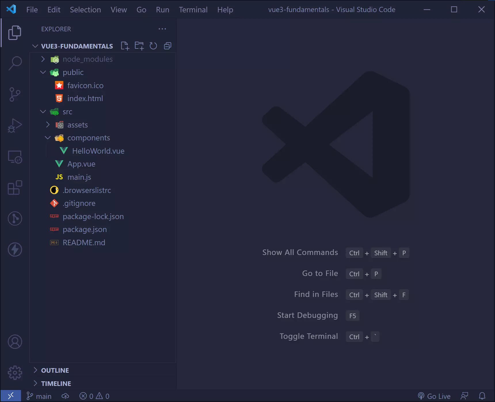
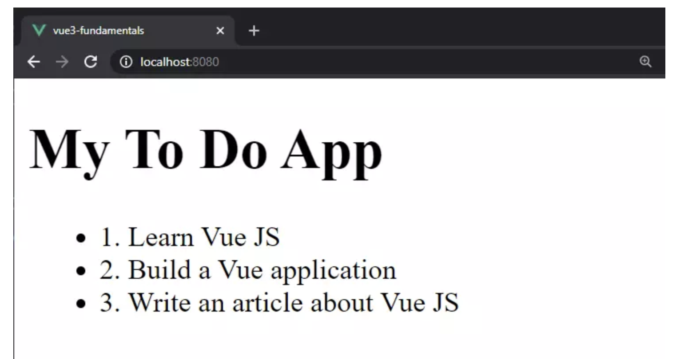
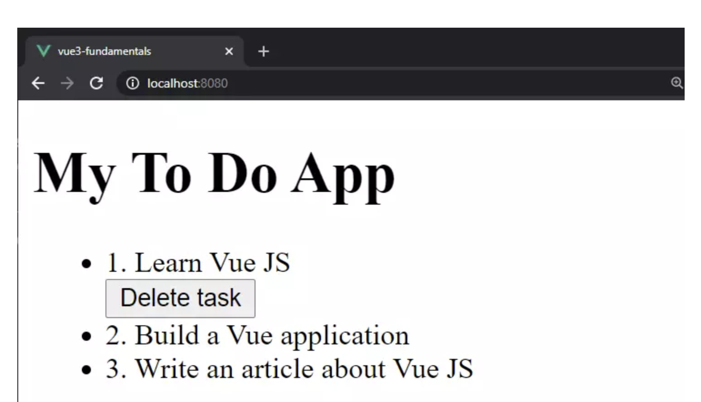
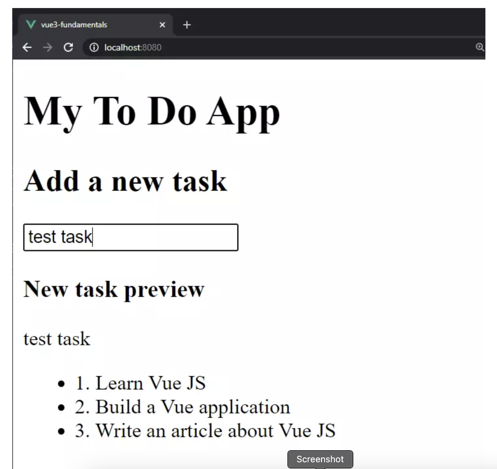
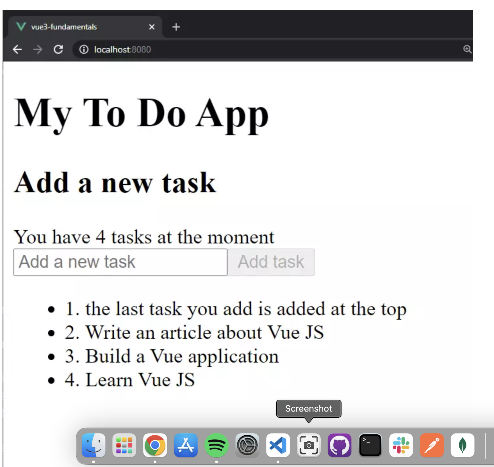

# A Beginner’s Guide to Vue 3

**Yeah, in english because we need to practice it!** 😀

This is a very simple guide to help you get started with Vue.js. It will walk
you through the process of setting up a new Vue project and creating your first
very basic Vue app.

## Content

- Create a Vue application with Vue CLI
- Render lists
- Use conditional rendering
- Handle user inputs and events
- Use methods and computed properties
- Use HTML attribute binding
- Make use of dynamic CSS (Tailwind CSS)

**Let's get started!**

## Step 1: Install the Vue CLI

Note: This tutorial assumes that you have already installed node and npm on your
machine. If not, you can download and install them from the official websites.

The Vue CLI is a command-line interface for Vue.js. You can install it globally
on your machine with the following command:

```bash
npm install -g @vue/cli
```

or you can use the following command

```bash
npm i -g @vue/cli
```

Remember that you also can use `yarn` as well.

## Step 2: Create a new Vue project

Navigate to the directory where you want to create your new project, and run the
following command:

```bash
vue create my-vue-app
```

Replace "my-vue-app" with the name you want for your project.

Once we’ve run the vue create command, we’ll be prompted with a handful of
questions. The purpose of these questions is to configure the project to suit
our needs. For now, we’ll just select the default options by pressing Enter.

Before going further, I want to make sure we’re on the same page :

- Run vue create vue3-fundamentals in your terminal.
- Choose “manually select features”.
- Untick all features except Babel. For this tutorial, we don’t need any extra
  features.
- Choose Vue version 3.
- Choose “In dedicated config files” when it asks you where to place the config
  for - Babel, and so on.
- Don’t save the preset for future projects.

After following the above steps, the project structure should look like this:



## Step 3: Serve the application

Just to check everything is ok, we gonna serve the application using the
following command:

```bash
npm run serve
```

Now open your browser and navigate to http://localhost:8080/ to see your new Vue
app in action.

## Step 4: Preparing and cleaning up the application

Before we start coding, let’s clean up the project a bit. We don’t need the
complete HelloWorld component, so we can remove it from the src/components
directory. We also don’t need the HelloWorld.vue file from the src/components
directory, so we can remove that as well.

Now go to the `App.vue` file and remove all the references of `HelloWorld` from
the file. Also, remove the image with the Vue logo. Lastly, modify the
`export default {}` code block. It should look like this:

```javascript
<template>
  <h1>{{ title }}</h1>
</template>

<script>
export default {
  data() {
    return {
      title: "My To Do App",
    };
  },
};
</script>
```

## Step 5: Create a new component

The first concept we’ll cover is how to render lists in a Vue application.
However, before we can do that, we need a list.

Open the App.vue file and add the following array:

```javascript
// App.vue

<script>
export default {
  data() {
    return {
      title: 'My To Do App',
      tasks: [
        { id: 1, name: 'Learn Vue JS', finished: false },
        { id: 2, name: 'Build a Vue application', finished: false },
        { id: 3, name: 'Write an article about Vue JS', finished: false }
      ]
    }
  }
}
</script>
```

In the above code snippet, we added an array of objects. Each object represents
an individual task, and each task contains the following:

- An ID: we can identify each task by its unique ID
- A name: it describes what the task is about
- A finished field: it represents whether the person finished the task or not

**Yeah, you're right! We're going to build a To-Do App!!!!** 📝 And we're going
to explore the vue-js options by practicing them.

## Step 6: Render lists

The next step is to loop over the array and render it on the page. In Vue, we
can loop over lists with the `v-for` directive. The `v-for` directive has the
form of `task in task`s (Remember the for-of and for-in loops that we learned in
"Fundamentos 1"), where each task represents an individual item in the array,
and the tasks represents the array.

We can see the v-for directive in action in the code snippet below:

```html
<ul>
  <li v-for="task in tasks" :key="task.id">{{task.id}}. {{ task.name }}</li>
</ul>
```

in vue we can render items or task using the Mustache notation. We use the
Mustache notation by using those double curly braces.

At the moment, it only displays the ID and the name of the tasks. But we could
also show whether it’s finished or not as follows:

```html
{{ task.id }}. {{ task.name }} - {{ task.finished}}
```

However, we’ll use that field (`finished`) for other purposes later in the
tutorial. If we save the code and run the application, we should see something
as follows:



### Unique key

You may have noticed the following bit of code:

```html
:key="task.id"
```

It’s recommended to use the :key attribute when we loop over lists in vue. The
reason is so that each DOM element has a unique key. Thus, Vue can track each
node’s identity to reuse and reorder existing elements. **As a result, it also
improves the performance of the application.**

### Conditional rendering

There are occasions when we want to display something on the page based on a
specific condition. Thus, we can use the `v-if` directive to render a piece of
code based on a condition. For example, we can use the v-if directive to display
a message if the task is finished.

This directive works like this, the block of code will only be rendered if the
expression inside the v-if directive is truthy.

In our example we might want a Delete task button to show after we finish a
task. Thus, we can delete a task when we’re done with it.

Let’s add the Delete task button. Go to the `App.vue` file and add the following
code in the unordered list:

```html
<ul>
  <li v-for="task in tasks" :key="task.id">
    {{ task.id }}. {{ task.name }}

    <div v-if="task.finished">
      <button>Delete task</button>
    </div>
  </li>
</ul>
```

You can see the new `div` with the `v-if` directive. Its purpose is to check if
the task is finished. If the task is completed, it shows the delete button. If
the task isn’t finished, the button is hidden.

Do you want to check if the directive works as expected, go and change manually
the `finished` field on any task from the `task` array to true. After that,
refresh the application, and we should see the delete button.



**Yeah, I know, it's not a beautiful app, but we're learning the basics of
Vue.js, and we're going to improve it step by step.**

Well know you have a new tool for your programming skills, The v-if directive is
handy when we want to render something based on a condition.

Before moving on, it’s important to note that we can use `v-else-if` and
`v-else` too. For instance, we could have something similar to this:

```html
<ul>
  <li v-for="task in tasks" :key="task.id">
    {{ task.id }}. {{ task.name }}

    <div v-if="task.finished">
      <button>Delete task</button>
    </div>
    <div v-else-if="task.edit">
      <button>Edit task</button>
    </div>
    <div v-else>
      <p>No button</p>
    </div>
  </li>
</ul>
```

You can see how powerful conditional rendering is. However, for this tutorial,
we’re using only the `v-if`.

## Step 7: Handle user inputs and events

The next step is to handle the user input. First of all, go to the `App.vue`
file and add the following HTML code under the application title:

```html
<h2>Add a new task</h2>

<div>
  <input type="text" v-model="newTask" placeholder="Add a new task" />
</div>

<div v-if="newTask.length > 0">
  <h3>New task preview</h3>
  <p>{{ newTask }}</p>
</div>
```

In the above code snippet, we add a text input that allows users to add new
tasks. Also, you’ll note the `v-model` directive. The `v-model` directive
enables us to create
[two-way binding](https://vuejs.org/guide/components/v-model.html) between the
input field and the application state. (You can learn more about v-model in
“Understanding the New Reactivity System in Vue 3”.)

Buuuuuttt, wait!!! Before we can try out the code, add the newTask field in the
Vue instance as follows:

```javascript
return {
  title: "My To Do App",
  newTask: "",
  tasks: [
    { id: 1, name: "Learn Vue JS", finished: false },
    { id: 2, name: "Build a Vue application", finished: false },
    { id: 3, name: "Write an article about Vue JS", finished: false },
  ],
};
```

If we run the application and type anything in the input field, we’ll see the
text appearing under the input field.



### step 8: Use methods and computed properties

Before learning about **handling user events**, we need to learn about methods.
The reason is that we’ll use methods to handle those user events.

All Vue instances have a property called methods, where we add all our methods.
For example, we’ll add a button that allows us to add tasks. Thus, we
encapsulate the logic for that button in a method, and we add it to the methods
field.

Open the file `App.vue` and add the following code after `data()`:

```javascript
methods: {
    addTask() {
      if (this.newTask.length < 1) return

      this.tasks.push({
        id: this.tasks.length + 1,
        name: this.newTask,
        finished: false
      });

      this.newTask = ''
    }
  }
```

Let's look at the code above. We added a method called `addTask` to the methods
field. This method does the following:

The above code only adds a task if the user entered something in the input field
and then clears the field. That is to prevent entering empty strings into our
tasks list.

Now, we can use the `addTask()` method as we would in any other application. We
call the method, and the method will run, which is precisely what the next step
is about.

SPOILER ALERT: The application will have two more methods

- `finishTask()`: This method will change the finished field to true when we
  click the delete button.

- `deleteTask()`: This method will remove the task from the tasks array when we

So at this point the App.vue file should look something like
[this](https://gist.github.com/SitePointEditors/413e784c6195dd9797e32001f9c0ac27)

## Step 8: Handling User Events

Now that you know what methods are about, it’s time to learn about handling user
events. For instance, what happens when the user clicks on the `Add task`
button?

We can add an `event listener` to that button. In Vue, we can listen to events
with the `v-on` directive. When an event such as the user clicking a button is
triggered, the application runs the specified method.

Let’s see it in action. Go to the `App.vue` file and add a button under the
input field. We should have the following code:

```html
<div>
  <input type="text" v-model="newTask" placeholder="Add a new task" />

  <button @click="addTask" :disabled="newTask.length < 1">Add task</button>
</div>

<div v-if="newTask.length > 0">
  <h3>New task preview</h3>
  <p>{{ newTask }}</p>
</div>
```

Observe the `@click="addTask" `code. The `v-on` directive has a shorthand
symbol, which is the `@` symbol. Thus, instead of writing `v-on:click`, we can
write it as shown above.

Clicking on the `Add task` button triggers the method `addTask()`, which adds
the task. Therefore, with the `v-on` directive, we can listen to user events and
call a specific method when they are triggered.

Note: check
[here](https://gist.github.com/SitePointEditors/0fc466537250310b7dfb43ddadb45812)
for the complete code in case you are a bit loose

### Computed properties

Another handy feature in Vue is computed properties. They’re similar to methods,
except that they should not mutate data. However, the computed properties are
great for manipulating data and reusing it across our application.

For this application, we’ll add two computed properties:

- One that returns the number of all tasks.
- One that returns the tasks’ array in reverse order. Why? We need it to show
  the latest tasks at the top of the list.

In App.vue, add the following code under the methods property:

```javascript
computed: {
    allTasks() {
        return this.tasks.length
    },
    latest() {
        return [...this.tasks].reverse()
    }
  }
```

Let’s break down the code above:

- We added a computed property called `allTasks`. This property returns the
  number of all tasks in the tasks array. We can use it in the application to
  show the total number of tasks.

- We added another computed property called `latest`. This property returns the
  tasks’ array in reverse order. We can use it to show the latest tasks at the
  top of the list. This is because a computed property should not mutate the
  existing data.

  In our template, find the “`Add a new task`” section and add the following
  line underneath:

```html
<span>
  You have {{ allTasks }} {{ allTasks > 1 ? 'tasks' : 'task' }} at the moment
</span>
```

IMPORTANT: ⏰

Lastly, go to the piece of code where we loop over the array of tasks and change
`task in tasks` to `task in latest`. This is how our code should look now:

```html
<ul>
  <li v-for="(task, index) in latest" :key="task.id">
    {{ index + 1 }}. {{ task.name }}

    <div v-if="task.finished">
      <button>Delete task</button>
    </div>
  </li>
</ul>
```

We now loop over the `latest`, and we also have an `index` field now. The new
field is used to show the position of the tasks in the list.



**ALSO IMPORTANT: ⏰ `Computed` properties VS. `methods`**

Before moving further, WE HAVE to emphasize again that they’re similar but
different. We should use methods to mutate data and use the computed properties
for the presentation layer.

Mutating data in the computed properties can result in bugs that are hard to
spot.

## Step 9: Use HTML attribute binding

In Vue, we can bind HTML attributes to Vue data with the `v-bind` directive.
That is, we can use dynamic values rather than hardcoded values for our
attributes.

Let’s make use of the attribute binding by adding a logo. Go to the App.vue and
add two new fields, logoURL and logoCaption. Our code should look as follows:

```javascript
data() {
    return {
      title: 'My To Do App',
      newTask: '',
      logoURL: 'https://images.unsplash.com/photo-1507925921958-8a62f3d1a50d?ixid=MnwxMjA3fDB8MHxwaG90by1wYWdlfHx8fGVufDB8fHx8&ixlib=rb-1.2.1&auto=format&fit=crop&w=1955&q=80',
      logoCaption: 'A photo by Kelly Sikkema on Unsplash showing post-it notes',
      tasks: [
        { id: 1, name: 'Learn Vue JS', finished: false },
        { id: 2, name: 'Build a Vue application', finished: false },
        { id: 3, name: 'Write an article about Vue JS', finished: false }
      ]
    }
  },
```

Note: If you want to use your own image, you can replace the logoURL with the
one you want.

Then, in the same file, add the following HTML `img` element above the
application title:

```html

```

Observe the colons in the `:src` and `:alt` attributes. They’re the shorthand of
`v-bind`. Thus, instead of writing `v-bind:src`, we write it `:src`.

## Step 10: Make use of dynamic CSS (Tailwind CSS)

- Install Tailwind CSS:

  ```bash
  npm install -D tailwindcss postcss autoprefixer
  ```

  From previous exercises, we know what the `-D` flag means. It’s a shorthand
  for `--save-dev`. Thus, we’re installing Tailwind CSS as a development
  dependency.

- Generate the tailwind.config.js file by running the following command:

  ```bash
  npx tailwindcss init -p
  ```

  The -p flag is a shorthand for --postcss. is a command line instruction that
  uses npx to initialize a new Tailwind CSS project with a PostCSS
  configuration.

  - Configure the template paths inside the `tailwind.config.js` file:

  ```javascript
  module.exports = {
    content: ["./index.html", "./src/**/*.{vue,js,ts,jsx,tsx}"],
    theme: {
      extend: {},
    },
    plugins: [],
  };
  ```

- Create a new ./src/index.css file and add the Tailwind directives: (This is
  the file that will import Tailwind CSS)

  ```css
  @import "tailwindcss/base";
  @import "tailwindcss/components";
  @import "tailwindcss/utilities";
  ```

- Import the newly created CSS file inside your ./src/main.js file:

```javascript
import { createApp } from "vue";
import App from "./App.vue";

// add this
import "./index.css";

createApp(App).mount("#app");
```

## TASK (Jejejeje 😈)

- Add the Tailwind CSS classes to the `App.vue` file. You can use the classes to
  style the application as you like.
